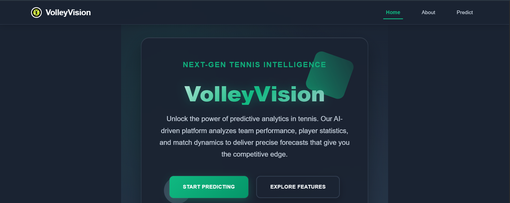

A Machine Learning-based tennis match predictor.

VolleyVision is a web application that predicts the outcome of tennis matches based on player selection and surface type (Hard, Clay, or Grass). Users can select ATP players who have played official tour-level matches since 2000, and view predictions including the likely winner and their winning probability.

The prediction engine is trained on over 68,000 match data points spanning 25 years, sourced from the JeffSackmann tennis datasets.

# Tech Stack:
Frontend: React, deployed on Vercel
Backend: Python, FastAPI, deployed on Render

